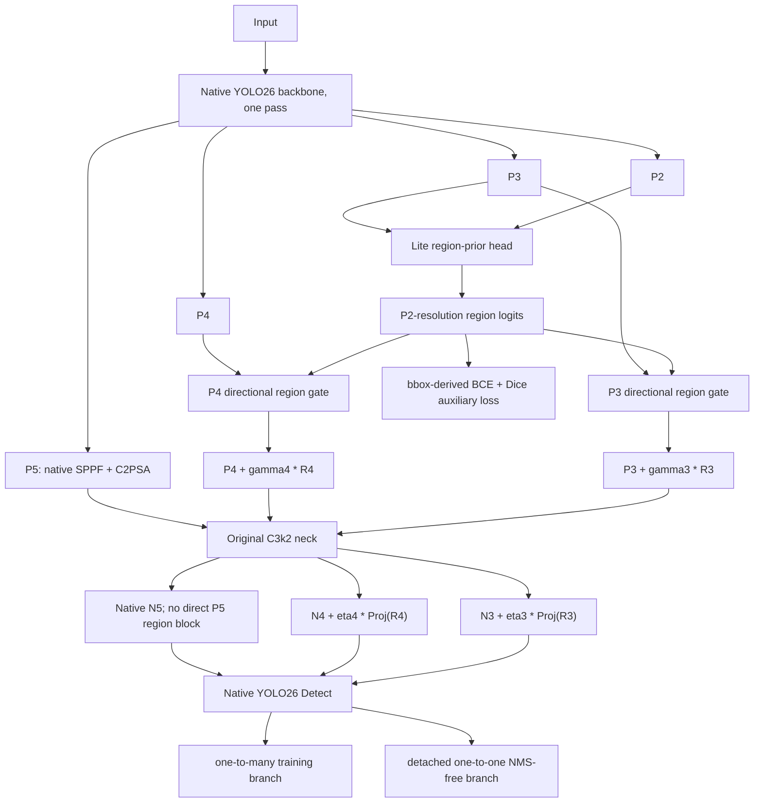

# Progressive LiteRG-YOLO26 migration

## Decision

This route is implementable without copying RDD-RGNet's YOLOv8 layer numbers, second backbone pass, CPU/NumPy hard-mask generator, or heavy `Concat -> C2f -> Coordinate Attention` Second-RG blocks. The implementation keeps the original YOLO26 layer topology and checkpoint keys, then enables region guidance only when `lite_rg.enabled` is present in the model YAML.

Reference mapping for this migration:

- Reviewed RDD-RGNet source: `F:\deeplearning\LiteRG`
- Source repository: `https://github.com/Leima0214/LiteRG`
- YOLO26 target: `F:\deeplearning\YOLO26N-NEW`

## Implemented architecture



The region residual scales `gamma3`, `gamma4`, `eta3`, and `eta4` start at zero. Therefore a freshly constructed candidate loaded with `yolo26n.pt` has the same detection computation as B0 at step zero, while the region-prior head receives its auxiliary gradient immediately. P2 is a prior source only; Detect remains P3/P4/P5.

The directional gate uses depthwise `1 x k` and `k x 1` convolutions, channel gating, and spatial gating. Lite-RFF uses depthwise-pointwise projection and addition rather than channel concatenation. For YOLO26n the side path contains about 92K parameters in the full configuration; the remote verification script reports the exact total and GFLOPs in the actual environment.

## Loss integration

`E2ELoss` itself is unchanged. `LiteRGE2ELoss` first calls the native Progressive E2E loss, including its original one-to-many/one-to-one weighting, then appends a fourth loss item:

```text
L_total = L_YOLO26_E2E + lambda_region(t) * (L_BCE + L_Dice)
lambda_region(t) = region_gain * max(o2m_weight(t), region_floor)
```

The soft target for every normalized `xywh` box is an axis-aligned Gaussian truncated to the box. Its horizontal and vertical standard deviations scale independently with box width and height, preserving continuity for thin D00/D10 boxes. Overlapping targets are merged by maximum. `target_mode: hard` fills the same boxes with ones for the controlled B1 comparison.

When `end2end: False`, `LiteRGDetectionLoss` appends the same auxiliary term to the unmodified one-to-many detection loss. This is only for the B6 accuracy/latency comparison; the default final model remains E2E.

## Files and reasons

| File | Change | Reason |
|---|---|---|
| `ultralytics/nn/yolo26_literg.py` | Prior head, DRG, zero-init residual gates, Lite-RFF | Isolate the complete lightweight region system in one module |
| `ultralytics/nn/tasks.py` | Optional feature interception at original P2/P3/P4/N3/N4 indices | Guide features before and after the native neck without shifting model keys |
| `ultralytics/utils/loss.py` | Hard/soft bbox targets and E2E/o2m region-loss wrappers | Keep native detection loss code intact and add region supervision outside it |
| `ultralytics/models/yolo/detect/train.py` | Conditional fourth loss label | Log `region_loss` only for LiteRG models |
| `ultralytics/cfg/models/26/yolo26-literg.yaml` | Full architecture and loss switches | Reproducible default B5/B7 configuration |
| `scripts/verify_literg_yolo26.py` | Transfer, zero-init, dual-head, forward/backward, FLOPs audit | Fail before training if a YOLO26 invariant is broken |
| `scripts/train_literg_ablation.py` | Matched B0-B7 experiment entry | Keep generic `train.py` untouched and prevent protocol drift |

## Remote GPU preflight

Run these commands from the repository root after pulling the branch:

```bash
/opt/conda/bin/python scripts/check_dataset.py --data configs/japan7_remote.yaml
/opt/conda/bin/python scripts/verify_literg_yolo26.py --weights yolo26n.pt --device cuda:0 --imgsz 640
```

The verifier must report all of the following before any formal run:

- every B0 state item transfers into the candidate;
- new state items are only under `lite_rg.*`;
- Japan7 transfer gaps are only the expected 80-to-7-class classifier tensors;
- zero-init decoded-output relative delta is below `1e-7`;
- one-to-many features retain gradients and one-to-one features are detached;
- four finite loss items are produced and the prior receives a gradient;
- parameters and GFLOPs remain within the planned lightweight range.

The requested experiment order is full-model first. Run a one-epoch B5 smoke:

```bash
/opt/conda/bin/python scripts/train_literg_ablation.py --stage B5 --epochs 1 --batch 8 --device 0 \
  --name literg_b5_full_e2e_smoke_1e_seed42
```

Only after the smoke is finite and validation completes should the full 30-epoch run start:

```bash
/opt/conda/bin/python scripts/train_literg_ablation.py --stage B5 --epochs 30 --device 0
```

`--stage` defaults to B5, so the same formal run can be started more simply with:

```bash
/opt/conda/bin/python scripts/train_literg_ablation.py --epochs 30 --device 0
```

Compare it with an already available B0 only when dataset split, checkpoint, image size, batch, seed, optimizer, warmup,
augmentation, validation IoU, and maximum detections all match. If no exact matched B0 exists, run only B0 next. B1-B4 and B6
remain available later to explain the source of any full-model gain; they are not prerequisites for the first B5 result.

The stages are deliberately cumulative:

| Stage | Region target | DRG | Lite-RFF | Progressive region weight | Detect mode |
|---|---|---:|---:|---:|---|
| B0 | none | no | no | no | E2E |
| B1 | hard rectangle | no | no | yes | E2E |
| B2 | soft Gaussian | no | no | yes | E2E |
| B3 | soft Gaussian | yes | no | yes | E2E |
| B4 | soft Gaussian | yes | yes | no | E2E |
| B5 | soft Gaussian | yes | yes | yes | E2E |
| B6 | soft Gaussian | yes | yes | yes | one-to-many + NMS |
| B7 | same as B5 | yes | yes | yes | one-to-one NMS-free |

B7 is normally the B5 checkpoint evaluated through its default one-to-one inference path, so it does not need a duplicate training run. The script still accepts `--stage B7` for an explicitly named reproduction.

## Experimental risks and controls

1. **The auxiliary target is still a box proxy.** Soft labels reduce background pollution but do not become pixel-accurate crack masks. Compare B1 and B2, visualize predicted priors, and do not claim segmentation supervision.
2. **Zero residual scales make the first optimization steps conservative.** This is intentional for B0 compatibility. Check that scale gradients are finite in preflight and plot the learned four scalar values after training.
3. **Region loss can dominate sparse scenes.** Keep `region_gain=0.5`, use the Progressive schedule, and tune it only after B2 is decisively positive. Do not change detection gains to compensate.
4. **P2 increases activation cost.** P2 is used only by the small prior head; there is no P2 Detect head. Reject variants outside the planned parameter/GFLOP and end-to-end latency budget.
5. **Dataset leakage invalidates small architecture rankings.** The repository audit has already flagged near-duplicate scenes in the old Japan7 split. Formal Paper 1 claims should use a scene/sequence-disjoint split; old-split runs are exploratory only.
6. **D00/D10 gains can hide class regressions.** Report mAP50-95, AP50, AP75, per-class AP, precision, recall, params, GFLOPs, GPU latency, CPU ONNX latency, and total postprocessed FPS.
7. **Latency comparison must include NMS where applicable.** B5/B7 one-to-one is NMS-free; B6 and YOLOv8 require NMS. Use identical image size, batch, warmup, repetitions, hardware, precision, and maximum detections.

The minimum evidence for retaining the route is a matched B2 improvement over B1, a D00/D10 improvement from B3, a favorable accuracy/compute change from B4/B5, and no unexplained B0 protocol drift. If an earlier gate fails, stop there instead of stacking the next module.
